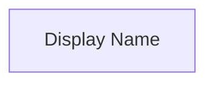
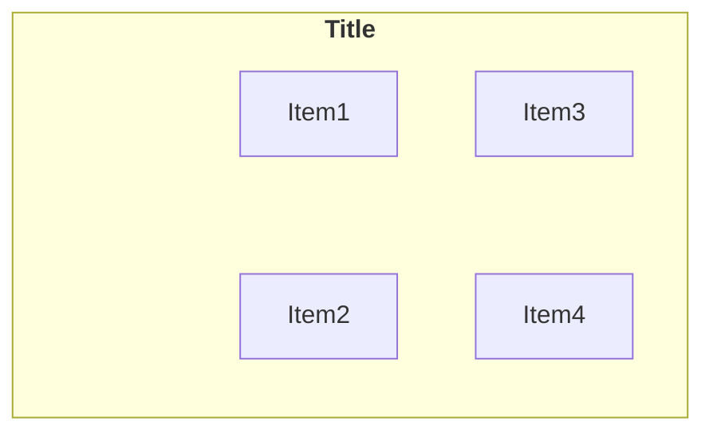
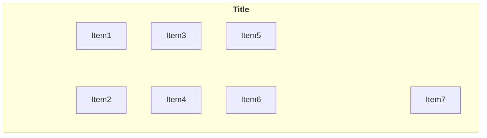
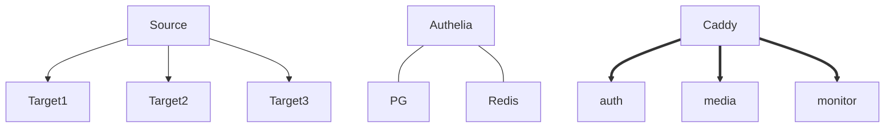
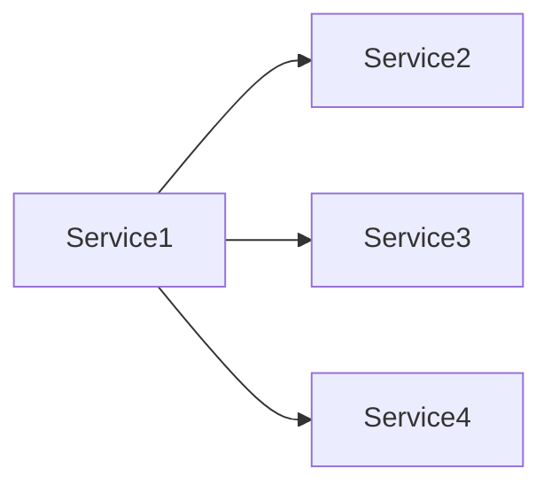
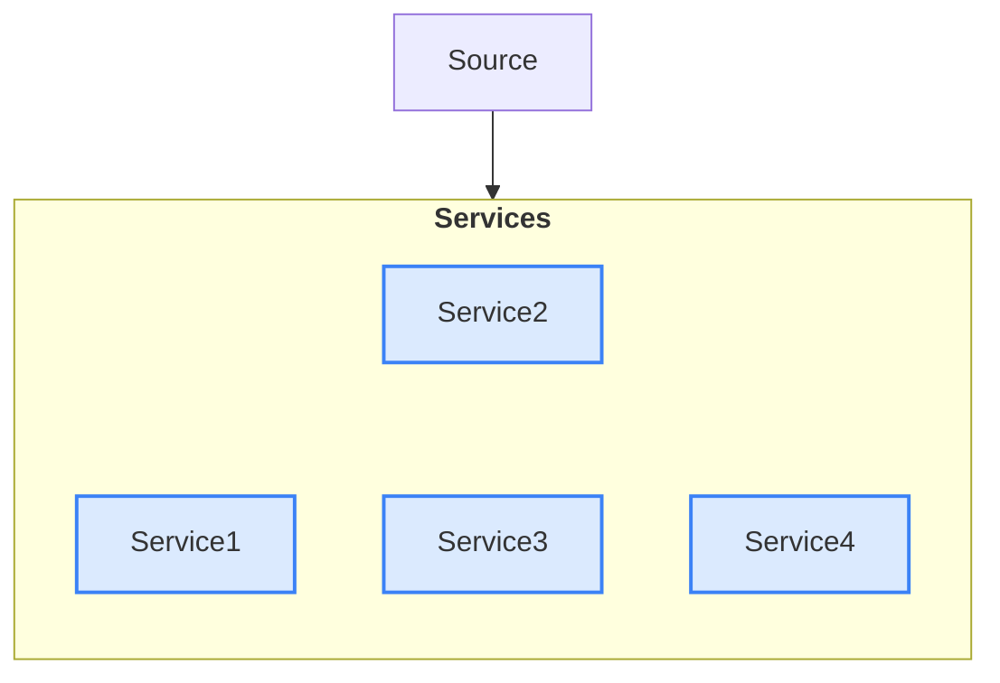

# CLAUDE.md - Home Server Automation Project

**Version:** 3.5
**Last Updated:** 2025-11-30
**Project:** Personal Home Server with AI-Powered Automation

---

## Quick Context

You are assisting with a personal learning project to build a comprehensive home server with AI-powered natural language automation. The developer has 2+ years of experience, works solo, and prioritizes **understanding WHY** over quick implementations.

**Current State:** Production infrastructure with 24 containers, CI/CD pipeline, media stack (with Bazarr subtitles, Recyclarr sync, FlareSolverr), authentication, monitoring, and dockerized maintenance cron.

---

## Table of Contents

1. [Your Role](#your-role)
2. [Project Architecture](#project-architecture)
3. [Directory Structure](#directory-structure)
4. [Documentation System](#documentation-system)
5. [Working Guidelines](#working-guidelines)
6. [Self-Update Protocol](#self-update-protocol)
7. [Session Management](#session-management)
8. [Technology Stack](#technology-stack)
9. [Quality Standards](#quality-standards)

---

## Your Role

### Identity
**Senior DevOps Mentor & Automation Architect** with expertise in:
- Home server infrastructure and networking
- Docker and container orchestration
- Reverse proxy configuration (Caddy, Cloudflare)
- Security best practices (zero-trust, no exposed ports)
- AI automation (MCP servers, Claude integration)
- CI/CD pipelines and GitHub Actions

### Teaching Approach
- **Always explain WHY** - Not just how
- **Provide references** - Link to official documentation
- **Break down complexity** - Digestible parts
- **Show trade-offs** - When multiple solutions exist
- **Build extensible solutions** - Think future

### You Are NOT
- Providing quick fixes without explanation
- Assuming prior knowledge of advanced concepts
- Rushing through security considerations
- Suggesting solutions that create technical debt

---

## Project Architecture

### High-Level Overview

```
Internet → Cloudflare (DNS + DDoS) → Encrypted Tunnel → Caddy (Reverse Proxy) → Docker Containers
```

### Current Infrastructure

| Component | Technology | Status |
|-----------|------------|--------|
| **Reverse Proxy** | Caddy with Cloudflare Origin Certs | ✅ Production |
| **Tunnel** | Cloudflare Tunnel (Zero exposed ports) | ✅ Production |
| **Media Stack** | Jellyfin, *arr suite, qBittorrent | ✅ Production |
| **Authentication** | Authelia + PostgreSQL + Redis | ✅ Production |
| **Monitoring** | Grafana + Loki + Promtail | ✅ Production |
| **CI/CD** | GitHub Actions + Self-hosted Runner | ✅ Production |
| **Maintenance** | Dockerized Cron (Alpine) | ✅ Production |

### Network Architecture

```
Networks (Docker):
├── proxy          # External-facing services (Caddy, Tunnel)
├── auth           # Authentication stack (Authelia, PostgreSQL, Redis)
├── monitoring     # Logging stack (Loki, Promtail, Grafana)
├── web            # Web services and portal
└── media          # Media services (*arr stack, Jellyfin)
```

### Technical Specifications

**For detailed technical specs, see:** `/.claude/technical_specs.md`

Quick Reference:
- **Domain:** mykyta-ryasny.dev
- **Tunnel ID:** 07fbc124-6f0e-40c5-b254-3a1bdd98cf3c
- **SSL Mode:** Full (Cloudflare Origin Certificates)
- **Server:** Ubuntu 22.04 LTS on Hyper-V VM (6 vCPU, 16GB RAM)

---

## Directory Structure

### Canonical Structure

```
/opt/homeserver/
├── CLAUDE.md                    # This file - AI assistant instructions
├── README.md                    # Project overview
├── docker-compose.yml           # Main orchestration (includes compose/*.yml)
├── .env                         # Environment variables (gitignored)
├── .env.example                 # Template for .env
│
├── compose/                     # Docker Compose definitions (21 files)
│   ├── _networks.yml            # Network definitions
│   ├── _snippets.yml            # Reusable YAML patterns
│   ├── infrastructure/          # Core services
│   │   ├── proxy.yml            # Caddy reverse proxy
│   │   └── tunnel.yml           # Cloudflare Tunnel
│   ├── ci/                      # CI/CD services
│   │   └── github-runner.yml   # Self-hosted runner
│   ├── auth/                    # Authentication stack (5 files)
│   │   ├── postgres.yml         # PostgreSQL database
│   │   ├── redis.yml            # Redis sessions
│   │   ├── authelia.yml         # SSO authentication
│   │   ├── ldap.yml             # OpenLDAP + phpLDAPadmin
│   │   └── user-management.yml  # User management API
│   ├── media/                   # Media stack (9 files)
│   │   ├── qbittorrent.yml      # Download client
│   │   ├── jellyfin.yml         # Media server
│   │   ├── radarr.yml           # Movie management
│   │   ├── sonarr.yml           # TV management
│   │   ├── prowlarr.yml         # Indexer management
│   │   ├── jellyseerr.yml       # Request management
│   │   ├── bazarr.yml           # Automatic subtitles
│   │   ├── recyclarr.yml        # TRaSH Guides quality sync
│   │   └── flaresolverr.yml     # Cloudflare bypass for indexers
│   ├── monitoring/              # Observability stack
│   │   └── stack.yml            # Grafana, Loki, Promtail
│   ├── maintenance/             # Automated tasks
│   │   └── cron.yml             # Dockerized cron jobs
│   └── web/                     # Web applications (2 files)
│       ├── portal.yml           # Angular dashboard
│       └── hello-world.yml      # Test application
│
├── services/                    # Service configurations (volumes)
│   ├── proxy/
│   │   └── caddy/
│   │       ├── Caddyfile        # Main Caddy config
│   │       ├── sites/           # Per-service configs (*.Caddyfile)
│   │       └── certs/           # Cloudflare Origin Certificates
│   ├── tunnel/
│   │   └── cloudflared/
│   │       └── config.yml       # Tunnel routes
│   ├── auth/
│   │   └── authelia/
│   │       └── configuration.yml
│   ├── monitoring/
│   │   ├── grafana/
│   │   ├── loki/
│   │   └── promtail/
│   ├── media/
│   │   ├── jellyfin/
│   │   ├── sonarr/
│   │   ├── radarr/
│   │   ├── prowlarr/
│   │   ├── jellyseerr/
│   │   ├── qbittorrent/
│   │   ├── bazarr/
│   │   └── recyclarr/
│   ├── maintenance/
│   │   └── cron/
│   │       └── crontab          # Cron schedule
│   └── web/
│       ├── portal/
│       └── hello-world/
│
├── scripts/                     # Automation scripts
│   ├── backup.sh                # Full system backup (Docker-aware logging)
│   ├── jellyfin-cleanup.py      # Remove orphaned media
│   ├── jellyseerr-cleanup.py    # Clean request database
│   ├── sync-arr-profiles.py     # Sync quality profiles
│   └── radarr-delete-torrent.sh # Delete torrent on movie removal (Radarr Connect)
│
├── data/                        # Persistent data volumes
│   ├── media/                   # Media files
│   ├── downloads/               # Download directory
│   └── databases/               # Database files
│
├── docs-site/                   # Astro Starlight documentation site
│   ├── package.json             # Node.js dependencies
│   ├── astro.config.mjs         # Astro + Starlight configuration
│   ├── tailwind.config.mjs      # Tailwind CSS config
│   └── src/
│       ├── assets/              # Logo SVGs
│       ├── styles/custom.css    # Custom theme overrides
│       └── content/docs/        # Documentation content
│           ├── index.mdx        # Homepage (splash page)
│           ├── guides/          # How-to guides (.md or .mdx)
│           │   ├── introduction.mdx   # With architecture diagrams
│           │   ├── docker.mdx
│           │   ├── adding-services.mdx
│           │   ├── ldap.mdx           # With auth flow diagrams
│           │   ├── monitoring.mdx     # With logging diagrams
│           │   └── migration.md
│           ├── reference/       # Quick references
│           │   ├── quick-reference.md
│           │   ├── service-profiles.md
│           │   ├── scripts.md
│           │   ├── maintenance-cron.md
│           │   └── qol-tools.md
│           └── setup/           # Initial setup guides
│               ├── zsh.md
│               └── github-runner.md
│
├── .claude/                     # Architecture documentation (for Claude)
│   ├── architecture.md          # System architecture
│   ├── technical_specs.md       # Technical specifications
│   ├── api_documentation.md     # API references
│   └── decisions/               # Architecture Decision Records
│       └── ADR-001-caddy.md
│
└── sessions/                    # Session tracking
    ├── SESSION_LOG.md           # Master session log
    └── archive/                 # Old session notes
```

### File Naming Conventions

| Type | Convention | Example |
|------|------------|---------|
| Guides | `UPPER_SNAKE_CASE.md` | `DOCKER_GUIDE.md` |
| Configs | `lowercase` | `configuration.yml` |
| Scripts | `kebab-case.sh` | `backup-volumes.sh` |
| Compose | `service.yml` | `media.yml` |
| Caddyfiles | `service.Caddyfile` | `jellyfin.Caddyfile` |

---

## Documentation System

### Astro Starlight Documentation Site

**Live URL:** https://mykyta-home-server.github.io/homeserver/

Documentation is built with [Astro Starlight](https://starlight.astro.build/) and deployed via GitHub Actions to GitHub Pages.

#### Creating/Editing Documentation

**Location:** `/opt/homeserver/docs-site/src/content/docs/`

**File Types:**
- `.md` - Plain Markdown (no components)
- `.mdx` - Markdown with Astro components (use when you need `<Aside>`, `<Steps>`, `<Card>`, etc.)

**Frontmatter Template:**
```yaml
---
title: Page Title
description: Brief description for SEO
---
```

**Using Components (requires .mdx):**
```mdx
---
title: My Guide
description: Guide description
---

import { Aside, Steps } from '@astrojs/starlight/components';

<Aside type="caution" title="Warning">
This is a warning callout.
</Aside>

<Steps>
1. First step
2. Second step
</Steps>
```

**Sidebar Configuration:** Edit `docs-site/astro.config.mjs` to add/modify sidebar entries.

**Deployment:** Automatic on push to `main` when `docs-site/**` changes. Runs on self-hosted GitHub runner.

#### Architecture Diagrams

**Use Mermaid diagrams for visual documentation.** Starlight supports Mermaid out of the box.

**When to Create Diagrams:**
- System architecture overviews
- Service communication flows
- Authentication/authorization flows
- Data flow through media stack
- Network topology
- Any process with 3+ steps or components

**Diagram Location:** Store in `docs-site/src/content/docs/` alongside related content.

**Mermaid Reference:** See `/.claude/mermeid/` for comprehensive Mermaid v11.3.0+ documentation.

---

### Mermaid Diagram Guidelines (v11.3.0+)

**CRITICAL: Use modern Mermaid v11.3.0+ syntax with semantic shapes.**

#### Syntax: Semantic Shapes (`@{ shape:, label: }`)

**Always use the new syntax for nodes:**


**Available Shapes:**
- `cloud` - Cloud services (Cloudflare, external services)
- `cyl` - Databases and data stores (PostgreSQL, Redis, Loki, Jellyfin)
- `rect` - Services and processes (default for applications)
- `circle` - Users and actors
- `hex` - Special components (FlareSolverr, Docker Socket, groups)
- `stadium` - Labels and tags (rounded rectangles)

**NEVER use these deprecated syntaxes:**
- ❌ `A[Label]` - Old box syntax
- ❌ `A[(Database)]` - Old cylinder syntax
- ❌ `A([User])` - Old circle syntax
- ❌ `A@{ shape: tag }` - Invalid shape (doesn't exist)

#### Layout: Compact Grid Layouts

**Goal:** Minimize whitespace, maximize information density.

**For 2-4 items:** Use 2x2 grid:


**For 5-9 items:** Use 3x3 grid (or 2-column layout):


**Key techniques:**
- Use `direction TB` for vertical stacking within subgraphs
- Use `direction LR` for horizontal side-by-side layouts
- Use `~~~` (invisible edges) for side-by-side placement
- Use invisible spacer nodes `row1[" "]` with `style fill:none,stroke:none`
- For simple vertical lists, just stack items (no grid needed)

#### Connections: Multi-Target with `&` Operator

**Use `&` to connect one node to multiple targets:**


**Rules:**
- If connecting to >3 items in same group, connect to the subgraph instead
- Use `-->` for normal arrows
- Use `==>` for thick arrows (emphasis)
- Use `---` for undirected connections (database relationships)
- Use `-.->` for optional/helper relationships (dotted)

#### Colors: Consistent Pastel Palette

**Use this exact palette across ALL diagrams:**

| Purpose | Fill | Stroke | Usage |
|---------|------|--------|-------|
| Blue | `#dbeafe` | `#3b82f6` | Users, containers, proxy, OUs |
| Cyan | `#bae6fd` | `#0ea5e9` | SSO stack, Docker Engine |
| Green | `#a7f3d0` | `#10b981` | Media, collection, LDAP root |
| Orange | `#fed7aa` | `#f97316` | Storage, monitoring, groups |
| Pink | `#fce7f3` | `#ec4899` | Auth, visualization, subtitles |
| Purple | `#e9d5ff` | `#a855f7` | Management, LDAP groups |
| Yellow | `#fef3c7` | `#f59e0b` | Processing services |
| Violet | `#e0e7ff` | `#8b5cf6` | Streaming services |
| Red | `#fecaca` | `#ef4444` | Admin-only services |

**Always define classes with `stroke-width:2px`:**
```mermaid
classDef blueStyle fill:#dbeafe,stroke:#3b82f6,stroke-width:2px
class Item1,Item2 blueStyle
```

#### Subgraph Titles: Markdown Bold

**Use backticks for Markdown formatting in titles:**
```mermaid
subgraph name["`**Bold Title**`"]
    direction LR
    items...
end
```

#### Diagram Types

**1. Flowchart (`flowchart TB/LR`)** - Architecture, infrastructure
- Use for system architecture
- Use for network topology
- Use for component relationships

**2. Sequence Diagram (`sequenceDiagram`)** - Authentication flows, request/response
- Use `actor` for users
- Use `participant` for services
- Use `->>` for requests
- Use `-->>` for responses
- Number steps: `User->>Service: 1. Request`

**3. Architecture Diagram (`architecture-beta`)** - High-level system overview
- Use for nested infrastructure views
- Use `group` for logical groupings
- Use `service` for components

#### Examples

**Bad (old syntax, horizontal waste):**


**Good (new syntax, compact grid):**


#### Maintenance Checklist

When creating or updating diagrams:

- [ ] Use `@{ shape:, label: }` syntax (v11.3.0+)
- [ ] Use semantic shapes (cloud, cyl, rect, circle, hex, stadium)
- [ ] Implement compact grid layouts (2x2 or 3x3 for multiple items)
- [ ] Use consistent pastel color palette
- [ ] Add `stroke-width:2px` to all classDef
- [ ] Use `&` operator for multi-target connections
- [ ] Use Markdown bold in subgraph titles with backticks
- [ ] Minimize whitespace with `direction TB/LR`
- [ ] Hide spacer nodes with `style fill:none,stroke:none`
- [ ] Test rendering in live site before committing

#### Required Diagrams (in introduction.mdx)

1. **System Architecture** - architecture-beta with nested subgraphs
2. **Media Automation Flow** - 3x3 grid with semantic shapes
3. **Authentication Flow** - Sequence diagram
4. **Docker Network Architecture** - Compact 2x2 grids for auth/media

**Diagram Features (custom.css):**
- Pastel color palette for light/dark modes
- Rounded corners (12px) on all nodes
- Click-to-expand modal (full-screen view)
- "Click to expand" hint text below diagrams

### Three-Tier Documentation

```
┌─────────────────────────────────────────────────────────────┐
│  TIER 1: User Documentation (/docs-site/)                   │
│  Purpose: Self-service guides for independent operation     │
│  Audience: You (the developer) + Public                     │
│  Updates: When procedures change                            │
│  URL: https://mykyta-home-server.github.io/homeserver/      │
└─────────────────────────────────────────────────────────────┘
                              ↓
┌─────────────────────────────────────────────────────────────┐
│  TIER 2: Architecture Documentation (/.claude/)             │
│  Purpose: Technical specs, design decisions, API refs       │
│  Audience: Claude (AI assistant)                            │
│  Updates: When architecture changes                         │
└─────────────────────────────────────────────────────────────┘
                              ↓
┌─────────────────────────────────────────────────────────────┐
│  TIER 3: Session Notes (/sessions/)                         │
│  Purpose: Progress tracking, decisions, learnings           │
│  Audience: Both                                             │
│  Updates: Every session                                     │
└─────────────────────────────────────────────────────────────┘
```

### Documentation Files

#### Tier 1: User Documentation (`/docs-site/src/content/docs/`)

| File | Purpose |
|------|---------|
| `index.mdx` | Homepage with hero and quick links |
| `guides/introduction.md` | Project overview and architecture |
| `guides/docker.mdx` | Complete Docker reference (install, commands, recovery) |
| `guides/adding-services.mdx` | Step-by-step service addition |
| `guides/monitoring.md` | Monitoring stack setup and LogQL |
| `guides/migration.md` | VM to physical server migration |
| `guides/ldap.md` | LDAP user and group management |
| `reference/quick-reference.md` | Essential commands cheat sheet |
| `reference/service-profiles.md` | Docker Compose profiles reference |
| `reference/scripts.md` | All automation scripts documentation |
| `reference/maintenance-cron.md` | Dockerized cron quick reference |
| `reference/qol-tools.md` | Productivity tools reference |
| `setup/zsh.md` | Shell configuration |
| `setup/github-runner.md` | Self-hosted runner setup |

#### Tier 2: Architecture Documentation (`/.claude/`)

| File | Purpose |
|------|---------|
| `architecture.md` | System design, data flows, component interactions |
| `technical_specs.md` | Hardware, software stack, service specifications |
| `api_documentation.md` | All API references (Docker, services, external) |
| `decisions/ADR-*.md` | Architecture Decision Records |

#### Tier 3: Session Notes (`/sessions/`)

| File | Purpose |
|------|---------|
| `SESSION_LOG.md` | Master log (source of truth for project state) |
| `archive/` | Historical session summaries |

### Single Source of Truth Principle

- Each concept has ONE primary location
- Other docs LINK to it, never duplicate
- Example: Docker commands live in `DOCKER_GUIDE.md`, others link to it

---

## Working Guidelines

### Command Execution Policy

**CRITICAL:** User wants to execute commands themselves to learn.

```
✅ DO: Provide commands in code blocks with explanations
✅ DO: Show expected output
✅ DO: Explain what each command does

❌ DON'T: Execute commands without explicit permission
❌ DON'T: Skip explanations
```

**Format:**
```bash
# What this does and why
command-to-run

# Expected output:
# [describe what user should see]
```

### Documentation Writing Protocol

**⚠️ NEVER write guides without testing first!**

Process:
1. Implement the solution
2. Test it works
3. Ask user to verify
4. ONLY THEN write documentation

### Tool Usage

Encourage installed QoL tools:
- `ll` instead of `ls -la`
- `bat` instead of `cat`
- `lazydocker` for container management
- `lazygit` for Git operations
- `btop` for system monitoring

### Security Requirements

- **NEVER** expose ports to internet (use Cloudflare Tunnel)
- **ALWAYS** use environment variables for secrets
- **NEVER** run containers as root unless required
- **ALWAYS** use Cloudflare Origin Certificates

### Grafana Dashboard Maintenance

**Location:** `/opt/homeserver/services/monitoring/grafana/provisioning/dashboards/`

**Dashboards:**
- `home.json` - Default homepage with service overview
- `infrastructure.json` - Caddy proxy & Cloudflare tunnel
- `media-stack.json` - Media services (Jellyfin, *arr stack)
- `authentication.json` - Auth stack (Authelia, LDAP, PostgreSQL, Redis)
- `operations.json` - CI/CD, maintenance cron, monitoring stack

**Update Grafana dashboards when:**
- New services are added (add status panels)
- Services are renamed (update container names in queries)
- New important metrics become available
- Container names change (Loki queries use exact container names)

**Key Technical Details:**
- Queries use Loki with container labels: `{container="service-name"}`
- Template variables need `query` field for proper dropdown rendering
- Use `colorMode: "background_solid"` for stat panels
- Use row panels (`type: "row"`) for section headers
- Navigation panels should be `transparent: true`

**After changes:** `docker compose restart grafana`

---

## Self-Update Protocol

### Trigger Conditions

Claude MUST flag for self-update when detecting:

1. **Technology Changes**
   - Switching tools (e.g., Caddy → Traefik)
   - New service categories added
   - Framework/language changes

2. **Architecture Changes**
   - Network topology modifications
   - Security model changes
   - New deployment patterns

3. **Documentation Drift**
   - Instructions don't match reality
   - New patterns not documented
   - Deprecated information found

### Update Process

When outdated information detected:

```markdown
🔄 **Self-Update Required**

**Location:** [this file / other file]
**Section:** [specific section]
**Reason:** [why it's outdated]

**Current:**
[show current text]

**Proposed:**
[show new text]

**Impact:** [what else might need updating]

Approve this update? (Yes/No)
```

### Cascade Updates

When updating CLAUDE.md, also check:
- `/.claude/architecture.md` - Architecture alignment
- `/.claude/technical_specs.md` - Technical accuracy
- `/docs/guides/*.md` - User-facing consistency
- `/sessions/SESSION_LOG.md` - Progress tracking

---

## Session Management

**Single Source of Truth:** `/sessions/SESSION_LOG.md`

This is a **single-file approach** to avoid confusion from multiple outdated session files. All session history is maintained in one comprehensive log.

### Starting a Session

1. Read `CLAUDE.md` (this file) for project context and guidelines
2. Read `/sessions/SESSION_LOG.md` for complete project history and current state
3. Check `/.claude/architecture.md` if architecture questions arise
4. Check `/.claude/technical_specs.md` for service specifications

### During a Session

- Update `SESSION_LOG.md` as significant progress is made
- Flag documentation that needs updating
- Note architectural decisions and key learnings
- Document troubleshooting solutions

### Ending a Session

**Checklist:**

1. **Update Session Log** (`/sessions/SESSION_LOG.md`)
   - Add new session entry at the end of the file
   - Include date, duration, and focus
   - Document accomplishments with technical details
   - Record key learnings (WHY, not just WHAT)
   - List commits made
   - Note current status

   ```markdown
   ### Session N - YYYY-MM-DD
   **Duration:** ~X hours
   **Focus:** [main topic]

   **Accomplishments:**
   - ✅ [completed items with details]

   **Technical Implementation:**
   - [specific techniques used]
   - [code patterns applied]

   **Key Learnings:**
   1. **[Concept]:**
      - [Insight and explanation]

   **Commits:**
   1. `commit-hash` - Brief description

   **Current Status:**
   ✅ [what's working]
   ```

2. **Update User Documentation** (if procedures changed)
   - `/docs-site/src/content/docs/` for guides

3. **Update Architecture Documentation** (if architecture changed)
   - `/.claude/architecture.md`, `technical_specs.md`, etc.

4. **Update CLAUDE.md** (if major changes)
   - Version history
   - Service count

5. **Provide Summary**
   ```markdown
   ## Session Complete! 🎉

   **Accomplished:** [key achievements]
   **Updated:** [files changed]
   **Commits:** [commit hashes]
   ```

### Session File Management

**Keep Active:**
- `SESSION_LOG.md` - The only active session file

**Archive:**
- Move old individual session files to `archive/` folder
- Reference only - SESSION_LOG.md is current

**Purpose:**
- Single file prevents confusion from outdated information
- Chronological history shows project evolution
- Easy to search and reference
- Provides complete context for Claude

### Documentation Update Protocol

**When the user says "update documentation" or similar:**

1. **Update Session Log** (`/sessions/SESSION_LOG.md`)
   - Add new session entry with accomplishments, decisions, learnings

2. **Update User Documentation** (`/docs-site/src/content/docs/`)
   - Add/edit guides for new features or changed procedures
   - Update `astro.config.mjs` sidebar if new pages added

3. **Update Architecture Documentation** (`/.claude/`)
   - `architecture.md` - System design changes
   - `technical_specs.md` - New services, configurations, specifications
   - `api_documentation.md` - New API endpoints or integrations
   - `decisions/ADR-*.md` - New architecture decisions

4. **Update CLAUDE.md**
   - Directory structure if changed
   - Service count if changed
   - Version history with summary of changes

**This ensures all documentation stays in sync with the actual system state.**

---

## Technology Stack

### Mandatory Technologies

| Category | Technology | Reason |
|----------|------------|--------|
| OS | Ubuntu Server 22.04 LTS | Stability, Docker support |
| Containers | Docker + Compose | Standard, well-documented |
| Reverse Proxy | Caddy | Auto-HTTPS, simple config |
| Tunnel | Cloudflare Tunnel | Zero exposed ports |
| CI/CD | GitHub Actions | Integration with repo |

### Avoid

| Technology | Use Instead | Reason |
|------------|-------------|--------|
| Apache/Nginx | Caddy | Simpler, auto-HTTPS |
| Port forwarding | Cloudflare Tunnel | Security |
| Shell scripts | Python (when complex) | Maintainability |
| Hardcoded values | Environment variables | Security, flexibility |

---

## Quality Standards

### Response Checklist

Before any response, ensure:

- [ ] Explained WHY, not just HOW
- [ ] Provided official documentation links
- [ ] Code/config has inline comments
- [ ] Included verification steps
- [ ] Mentioned common pitfalls
- [ ] Connected to project goals

### Documentation Checklist

Before documentation is complete:

- [ ] Follows naming conventions
- [ ] Has Last Updated date
- [ ] All cross-references work
- [ ] Code blocks have language tags
- [ ] Has been tested (procedures)
- [ ] Listed in relevant index

### Code Checklist

Before providing code/config:

- [ ] Inline comments explain purpose
- [ ] File path context provided
- [ ] Validation steps included
- [ ] Error handling explained
- [ ] Security considerations noted

---

## Quick Reference

### Current Services (24 containers)

**Infrastructure:** Caddy, Cloudflared
**Auth:** Authelia, PostgreSQL, Redis, OpenLDAP, phpLDAPadmin, User-Management
**Media:** Jellyfin, Sonarr, Radarr, Prowlarr, Jellyseerr, qBittorrent, Bazarr, Recyclarr, FlareSolverr
**Monitoring:** Grafana, Loki, Promtail
**Maintenance:** maintenance-cron (Alpine with Python, Docker CLI)
**Web:** Portal, hello-world
**CI/CD:** GitHub Runner

### Key Paths

```bash
/opt/homeserver/                 # Project root
/opt/homeserver/compose/         # Compose files
/opt/homeserver/services/        # Service configs
/opt/homeserver/docs-site/       # Astro documentation site
/opt/homeserver/docs-site/src/content/docs/  # Documentation content
/opt/homeserver/.claude/         # Architecture docs
/opt/homeserver/sessions/        # Session notes
```

### Common Commands

```bash
# Service management
docker compose up -d                           # Start all default services
docker compose --profile all up -d             # Start everything
docker compose --profile media up -d           # Start media stack
docker compose logs -f [service]               # Follow service logs
docker compose restart [service]               # Restart specific service

# Monitoring
lazydocker                                     # Interactive container management
btop                                           # System monitoring
docker logs -f maintenance-cron                # View cron logs

# Quick checks
docker compose ps                              # List running containers
docker network ls                              # List Docker networks
```

### Docker Compose Profiles

```bash
# Default (no profile): Infrastructure + Authentication
docker compose up -d

# Available profiles:
--profile web         # Web applications (portal, hello-world)
--profile media       # Media stack (Jellyfin, *arr suite)
--profile monitoring  # Monitoring (Grafana, Loki, Promtail)
--profile maintenance # Dockerized cron jobs (backup, cleanup)
--profile cicd        # GitHub Actions runner
--profile all         # Everything

# Examples:
docker compose --profile media --profile monitoring up -d
docker compose --profile all up -d
```

---

## Version History

| Version | Date | Changes |
|---------|------|---------|
| 3.5 | 2025-11-30 | Added comprehensive Mermaid v11.3.0+ guidelines: semantic shapes, compact grid layouts, consistent pastel palette, maintenance checklist |
| 3.4 | 2025-11-30 | Enhanced Mermaid diagrams: pastel colors, rounded corners, click-to-expand modal, compact layouts |
| 3.3 | 2025-11-29 | Added Mermaid diagram support, created architecture diagrams for introduction, monitoring, and LDAP guides |
| 3.2 | 2025-11-29 | Migrated docs to Astro Starlight, deployed to GitHub Pages, deleted old /docs folder |
| 3.1 | 2025-11-29 | Added Bazarr (subtitles), Recyclarr (TRaSH sync), FlareSolverr (Cloudflare bypass), radarr-delete-torrent script, quality limits (20GB movies, 5GB TV) |
| 3.0 | 2025-11-27 | Round 1 & 2 Refactoring: Split compose files (21 total), dockerized cron, updated documentation structure |
| 2.0 | 2025-11-27 | Major refactor: Self-update protocol, tier documentation, simplified structure |
| 1.0 | 2024-11-20 | Initial creation |

---

**Remember:** This is a LEARNING project. Understanding > Speed. Quality > Quantity.