import { Card, CardGrid, Aside } from '@astrojs/starlight/components';

Welcome to the **Home Server** documentation! This project is a personal learning journey to build a comprehensive home server with AI-powered natural language automation.

## System Architecture

The entire infrastructure runs through a secure Cloudflare Tunnel with **zero exposed ports** on the home network.

## Current Infrastructure

The server currently runs **24 containers** across multiple service categories:

<CardGrid>
  <Card title="Infrastructure" icon="setting">
    Caddy reverse proxy with Cloudflare Tunnel for zero-trust networking
  </Card>
  <Card title="Authentication" icon="shield">
    Authelia SSO with LDAP backend, PostgreSQL, and Redis
  </Card>
  <Card title="Media Stack" icon="star">
    Complete *arr suite: Jellyfin, Sonarr, Radarr, Prowlarr, Jellyseerr, qBittorrent, Bazarr
  </Card>
  <Card title="Monitoring" icon="laptop">
    Grafana, Loki, and Promtail for centralized logging
  </Card>
</CardGrid>

## Media Automation Flow

The complete workflow from requesting content to streaming:

```mermaid
flowchart LR
    subgraph Request["📱 Request"]
        User([👤 User])
        JS[🎬 Jellyseerr]
    end

    subgraph Search["🔍 Search"]
        Radarr[🎥 Radarr]
        Sonarr[📺 Sonarr]
        Prowlarr[🔍 Prowlarr]
        Indexers[(Torrent<br/>Indexers)]
    end

    subgraph Download["⬇️ Download"]
        QB[qBittorrent]
        FS[FlareSolverr]
    end

    subgraph Process["⚙️ Process"]
        Import[Import &<br/>Rename]
        Bazarr[💬 Bazarr<br/>Subtitles]
    end

    subgraph Stream["📺 Stream"]
        JF[Jellyfin]
        Devices([📱💻📺<br/>Devices])
    end

    User -->|Request Movie/TV| JS
    JS -->|Movie| Radarr
    JS -->|TV Show| Sonarr
    Radarr --> Prowlarr
    Sonarr --> Prowlarr
    Prowlarr -->|Search| Indexers
    Indexers -->|Results| Prowlarr
    Prowlarr -->|Best Match| Radarr
    Prowlarr -->|Best Match| Sonarr
    Radarr -->|Download| QB
    Sonarr -->|Download| QB
    FS -.->|Cloudflare Bypass| Prowlarr
    QB -->|Complete| Import
    Import --> Bazarr
    Bazarr -->|Add Subtitles| JF
    JF --> Devices

    style JS fill:#1a73e8,color:#fff
    style JF fill:#00a4dc,color:#fff
    style QB fill:#2e7d32,color:#fff
```

## Authentication Flow

Single Sign-On across all services using LDAP:

```mermaid
sequenceDiagram
    participant User as 👤 User
    participant Browser as 🌐 Browser
    participant Caddy as 🔒 Caddy
    participant Authelia as 🛡️ Authelia
    participant LDAP as 📁 LDAP
    participant Service as 📺 Service

    User->>Browser: Access service.domain.com
    Browser->>Caddy: HTTPS Request
    Caddy->>Authelia: Forward Auth Check

    alt Not Authenticated
        Authelia-->>Browser: Redirect to Login
        User->>Authelia: Enter Credentials
        Authelia->>LDAP: Validate User
        LDAP-->>Authelia: User Valid
        Authelia-->>Browser: Set Session Cookie
        Browser->>Caddy: Retry with Cookie
    end

    Caddy->>Authelia: Verify Session
    Authelia-->>Caddy: Session Valid + Headers
    Caddy->>Service: Forward Request + Auth Headers
    Service-->>Browser: Response
```

## Docker Network Architecture

Services are isolated into purpose-specific networks:

## Key Features

<Aside type="tip" title="Security First">
All traffic goes through Cloudflare Tunnel - **zero ports exposed** to the internet. Your home IP is never revealed.
</Aside>

- **Zero exposed ports** - All traffic through Cloudflare Tunnel
- **Single Sign-On** - Authelia with LDAP backend
- **Centralized logging** - Grafana Loki stack
- **Media automation** - Complete *arr stack with automatic subtitles
- **Infrastructure as Code** - Everything version-controlled
- **Hardlinks** - Efficient storage with instant file moves

## Quick Links

<CardGrid>
  <Card title="Quick Reference" icon="document">
    Essential commands and shortcuts for daily operations.
    [View Reference →](/homeserver/reference/quick-reference)
  </Card>
  <Card title="Docker Guide" icon="setting">
    Complete Docker and container management guide.
    [View Guide →](/homeserver/guides/docker)
  </Card>
  <Card title="Adding Services" icon="add-document">
    Step-by-step guide to deploy new services.
    [View Guide →](/homeserver/guides/adding-services)
  </Card>
  <Card title="Monitoring" icon="laptop">
    Logs, metrics, and observability setup.
    [View Guide →](/homeserver/guides/monitoring)
  </Card>
</CardGrid>

## Technology Stack

| Component | Technology | Purpose |
|-----------|------------|---------|
| **OS** | Ubuntu Server 22.04 LTS | Stable, Docker-ready |
| **Containers** | Docker + Compose | Service isolation |
| **Reverse Proxy** | Caddy | Auto-HTTPS, simple config |
| **Tunnel** | Cloudflare Tunnel | Zero-trust networking |
| **Auth** | Authelia + LDAP | SSO across all services |
| **CI/CD** | GitHub Actions | Self-hosted runner |
