import { Aside, Steps, Card, CardGrid } from '@astrojs/starlight/components';

Unified authentication with OpenLDAP across all services. One username and password for everything.

## Authentication Architecture

```mermaid
flowchart TB
    subgraph LDAP["📁 OpenLDAP Directory"]
        Users[(ou=users)]
        Groups[(ou=groups)]
    end

    subgraph SSO["🛡️ Single Sign-On"]
        Authelia[Authelia SSO]
        PG[(PostgreSQL<br/>Sessions)]
        Redis[(Redis<br/>Cache)]
    end

    subgraph Protected["🔒 SSO Protected Services"]
        Grafana[📊 Grafana]
        Radarr[🎥 Radarr]
        Sonarr[📺 Sonarr]
        Prowlarr[🔍 Prowlarr]
        QB[⬇️ qBittorrent]
    end

    subgraph Direct["🎬 Direct LDAP Auth"]
        JF[📺 Jellyfin]
        JS[🎬 Jellyseerr]
    end

    subgraph Management["⚙️ Management"]
        PHPADMIN[phpLDAPadmin]
    end

    Users --> Authelia
    Groups --> Authelia
    Authelia --> PG
    Authelia --> Redis

    Authelia -->|Forward Auth| Grafana
    Authelia -->|Forward Auth| Radarr
    Authelia -->|Forward Auth| Sonarr
    Authelia -->|Forward Auth| Prowlarr
    Authelia -->|Forward Auth| QB

    Users --> JF
    Groups --> JF
    JF --> JS

    PHPADMIN --> Users
    PHPADMIN --> Groups

    style LDAP fill:#4caf50,color:#fff
    style SSO fill:#2196f3,color:#fff
    style Protected fill:#e3f2fd
    style Direct fill:#e8f5e9
```



## Directory Structure

The LDAP directory is organized with separate organizational units for users and groups:


**Base DN**: `dc=mykyta-ryasny,dc=dev`

| Path | Purpose |
|------|---------|
| `ou=users` | User accounts |
| `ou=groups` | Group memberships |

## Managing Users

Access phpLDAPadmin at: `https://ldap.mykyta-ryasny.dev`

<Aside type="tip" title="Recommended Method">
Use phpLDAPadmin for most user management tasks. The web interface is easier than CLI commands.
</Aside>

### Add User via CLI

```bash
docker exec -it openldap ldapadd -x -D "cn=admin,dc=mykyta-ryasny,dc=dev" -W << 'EOF'
dn: uid=newuser,ou=users,dc=mykyta-ryasny,dc=dev
objectClass: inetOrgPerson
objectClass: posixAccount
uid: newuser
cn: New User
sn: User
mail: newuser@example.com
uidNumber: 1001
gidNumber: 1001
homeDirectory: /home/newuser
userPassword: {SSHA}hashed_password
EOF
```

### Add User to Group

```bash
docker exec -it openldap ldapmodify -x -D "cn=admin,dc=mykyta-ryasny,dc=dev" -W << 'EOF'
dn: cn=family,ou=groups,dc=mykyta-ryasny,dc=dev
changetype: modify
add: member
member: uid=newuser,ou=users,dc=mykyta-ryasny,dc=dev
EOF
```

## Authentication Flow

```mermaid
sequenceDiagram
    participant User as 👤 User
    participant Service as 📺 Service
    participant Authelia as 🛡️ Authelia
    participant LDAP as 📁 LDAP

    User->>Service: Access service
    Service->>Authelia: Forward auth check

    alt Not logged in
        Authelia-->>User: Redirect to login
        User->>Authelia: Enter credentials
        Authelia->>LDAP: Validate (uid + password)
        LDAP-->>Authelia: User info + groups
        Authelia-->>User: Set session cookie
        User->>Service: Retry with cookie
    end

    Authelia->>LDAP: Get user groups
    LDAP-->>Authelia: Groups list
    Authelia-->>Service: User headers (name, email, groups)
    Service-->>User: Access granted
```



## Authelia Integration

Authelia connects to LDAP for user authentication and group membership:

```yaml
authentication_backend:
  ldap:
    address: ldap://openldap:389
    base_dn: dc=mykyta-ryasny,dc=dev
    users_filter: (&(|({username_attribute}={input}))(objectClass=inetOrgPerson))
    groups_filter: (&(member={dn})(objectClass=groupOfNames))
    user: cn=admin,dc=mykyta-ryasny,dc=dev
```

## Jellyfin Integration

Jellyfin uses direct LDAP authentication via its plugin:

<Steps>
1. Install the **LDAP-Auth** plugin from Jellyfin's plugin catalog

2. Configure LDAP connection:
   - **Server**: `ldap://openldap:389`
   - **Base DN**: `dc=mykyta-ryasny,dc=dev`
   - **Username Attribute**: `uid`

3. Configure admin filter:
   ```
   (memberOf=cn=admins,ou=groups,dc=mykyta-ryasny,dc=dev)
   ```

4. Restart Jellyfin to apply changes
</Steps>

<Aside type="caution" title="Jellyseerr Auth">
Jellyseerr authenticates through Jellyfin, not directly to LDAP. Users must exist in Jellyfin first (auto-created on login).
</Aside>

## Access Control

Group membership determines which services users can access:

```mermaid
flowchart LR
    subgraph Groups
        Admins[cn=admins]
        Family[cn=family]
    end

    subgraph AdminServices["Admin Services"]
        Grafana[📊 Grafana]
        Radarr[🎥 Radarr]
        Sonarr[📺 Sonarr]
        Prowlarr[🔍 Prowlarr]
        QB[⬇️ qBittorrent]
        LDAPADMIN[⚙️ phpLDAPadmin]
    end

    subgraph FamilyServices["Family Services"]
        JF[📺 Jellyfin]
        JS[🎬 Jellyseerr]
    end

    Admins --> AdminServices
    Admins --> FamilyServices
    Family --> FamilyServices

    style Admins fill:#f44336,color:#fff
    style Family fill:#4caf50,color:#fff
```



| Group | Access Level |
|-------|--------------|
| `admins` | All services (Grafana, Radarr, Sonarr, Prowlarr, qBittorrent, phpLDAPadmin) |
| `family` | Media services only (Jellyfin, Jellyseerr) |

## Quick Commands

<CardGrid>
  <Card title="List Users" icon="document">
    ```bash
    docker exec openldap ldapsearch -x -b "ou=users,dc=mykyta-ryasny,dc=dev" uid
    ```
  </Card>
  <Card title="List Groups" icon="list-format">
    ```bash
    docker exec openldap ldapsearch -x -b "ou=groups,dc=mykyta-ryasny,dc=dev" cn
    ```
  </Card>
</CardGrid>

## Troubleshooting

### User can't login

<Steps>
1. Verify user exists in LDAP:
   ```bash
   docker exec openldap ldapsearch -x -b "dc=mykyta-ryasny,dc=dev" "uid=username"
   ```

2. Check password works:
   ```bash
   docker exec openldap ldapwhoami -x -D "uid=username,ou=users,dc=mykyta-ryasny,dc=dev" -W
   ```

3. Verify group membership:
   ```bash
   docker exec openldap ldapsearch -x -b "ou=groups,dc=mykyta-ryasny,dc=dev" "(member=uid=username,ou=users,dc=mykyta-ryasny,dc=dev)"
   ```
</Steps>

### Authelia can't connect to LDAP

Check LDAP container is healthy:
```bash
docker logs openldap --tail 20
```

Verify network connectivity:
```bash
docker exec authelia nc -zv openldap 389
```
