import { Aside, Steps } from '@astrojs/starlight/components';

Centralized logging with Grafana, Loki, and Promtail for complete observability of your home server.

## Logging Architecture

```mermaid
flowchart LR
    subgraph Containers["🐳 Docker Containers"]
        C1[Jellyfin]
        C2[Radarr]
        C3[Sonarr]
        C4[Caddy]
        C5[...]
    end

    subgraph Collection["📋 Log Collection"]
        Promtail[Promtail<br/>Log Shipper]
        Socket[/Docker Socket/]
    end

    subgraph Storage["💾 Storage & Query"]
        Loki[Loki<br/>Log Aggregation]
        TSDB[(TSDB Index)]
        FS[(Filesystem<br/>Chunks)]
    end

    subgraph Visualization["📊 Visualization"]
        Grafana[Grafana<br/>Dashboards]
        User([👤 User])
    end

    C1 --> Socket
    C2 --> Socket
    C3 --> Socket
    C4 --> Socket
    C5 --> Socket
    Socket --> Promtail
    Promtail -->|Push Logs| Loki
    Loki --> TSDB
    Loki --> FS
    Grafana -->|LogQL Query| Loki
    User --> Grafana

    style Promtail fill:#00a86b,color:#fff
    style Loki fill:#f46800,color:#fff
    style Grafana fill:#f46800,color:#fff
```



## Stack Overview

| Component | Purpose | Port |
|-----------|---------|------|
| **Loki** | Log aggregation and storage | 3100 |
| **Promtail** | Collects logs from Docker containers | 9080 |
| **Grafana** | Visualization and querying | 3000 |

## Access

- **Grafana**: `https://monitor.mykyta-ryasny.dev`

<Aside type="tip" title="Authentication">
Grafana is protected by Authelia SSO. Login with your LDAP credentials.
</Aside>

## Log Flow

```mermaid
sequenceDiagram
    participant Container as 🐳 Container
    participant Docker as Docker Daemon
    participant Promtail as 📋 Promtail
    participant Loki as 📝 Loki
    participant Grafana as 📊 Grafana
    participant User as 👤 User

    Container->>Docker: stdout/stderr
    Docker->>Docker: Write to log file
    Promtail->>Docker: Read via socket
    Promtail->>Promtail: Extract labels
    Promtail->>Loki: Push log stream
    Loki->>Loki: Index & Store
    User->>Grafana: Query logs
    Grafana->>Loki: LogQL query
    Loki-->>Grafana: Results
    Grafana-->>User: Display logs
```



## LogQL Queries

### Basic Queries

```logql
# View all logs from a container
{container="jellyfin"}

# Filter by service group
{service_group="media"}

# Find errors across all containers
{container!=""} |= "error"

# Case-insensitive search
{container="caddy"} |~ "(?i)error"
```

### Advanced Queries

```logql
# Count errors per minute
count_over_time({level="error"}[1m])

# Top 5 noisiest containers
topk(5, sum by (container) (count_over_time({container!=""}[1h])))

# Parse JSON logs and filter
{container="caddy"} | json | status >= 400

# Rate of log lines per container
sum by (container) (rate({container!=""}[5m]))
```

### Service-Specific Queries

```logql
# Jellyfin playback issues
{container="jellyfin"} |= "playback" |= "error"

# Radarr import events
{container="radarr"} |= "imported"

# Caddy 5xx errors
{container="caddy"} | json | status >= 500

# qBittorrent download completions
{container="qbittorrent"} |= "Download finished"
```

## Labels

Promtail automatically extracts labels from Docker metadata:


| Label | Description | Example |
|-------|-------------|---------|
| `container` | Container name | `jellyfin` |
| `compose_service` | Docker Compose service name | `jellyfin` |
| `compose_project` | Docker Compose project | `homeserver` |
| `service_group` | Custom label (media, auth, etc.) | `media` |

## Configuration

### Loki (`loki-config.yml`)

```yaml
schema_config:
  configs:
    - from: 2024-01-01
      store: tsdb
      object_store: filesystem
      schema: v13
      index:
        prefix: index_
        period: 24h

limits_config:
  retention_period: 720h  # 30 days
```

### Promtail (`promtail-config.yml`)

```yaml
scrape_configs:
  - job_name: docker
    docker_sd_configs:
      - host: unix:///var/run/docker.sock
    relabel_configs:
      - source_labels: ['__meta_docker_container_name']
        regex: '/(.*)'
        target_label: container
```

## Troubleshooting

### No logs appearing

<Steps>
1. Check Promtail is running and connected:
   ```bash
   docker logs promtail --tail 20
   ```

2. Verify Loki is healthy:
   ```bash
   curl http://localhost:3100/ready
   ```

3. Check the Docker socket is accessible:
   ```bash
   docker exec promtail ls -la /var/run/docker.sock
   ```
</Steps>

### Query returns nothing

- Ensure label exists: `{container="name"}`
- Check time range in Grafana (top right)
- Verify container is running and producing logs
- Try a broader query first: `{container!=""}`

### High memory usage

<Aside type="caution">
Loki can consume significant memory with broad queries. Always use labels to filter.
</Aside>

```logql
# Bad - scans all logs
{job="docker"} |= "error"

# Good - filters by container first
{container="jellyfin"} |= "error"
```
